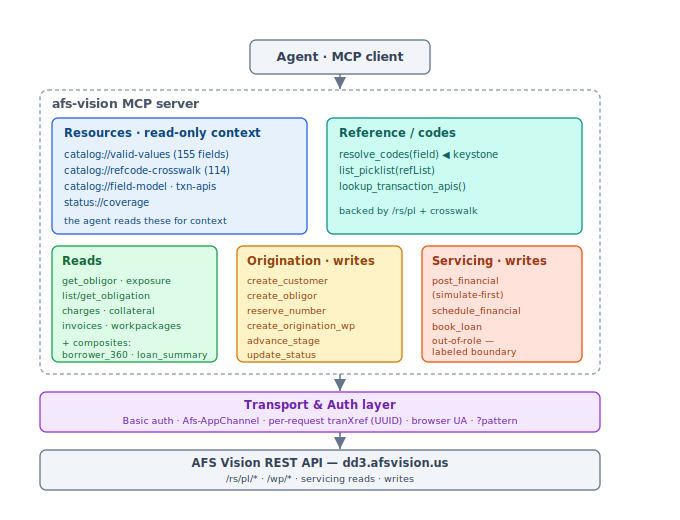

# AFS Vision MCP — design & tool catalog

The canonical design for the AFS Vision MCP, now that the API is mapped. Merges the
architectural wireframe with the full, findings-grounded tool catalog. Grounded in
[`api-discovery/`](../api-discovery/).

`★` = already implemented in [`lib/`](../lib/). **Status:** `now` = buildable today as
`AFSDD301` · `role` = needs broader read permission (403 today) · `wp-state` = needs a
live workpackage at the right stage · `out-of-role` = not API-triggerable for the
origination role.

## Design principles

**Shape**
1. **Curated, task-oriented surface — not 231 endpoints.** Tools are verbs that match how
   a banker thinks; each fans out internally to the right AFS calls. Composite tools
   (`get_borrower_360`, `loan_summary`) carry the most model value.
2. **Catalogs are MCP *resources*, not tools.** The valid-values catalog, the field→refList
   crosswalk, and the origination field model are read-only context the agent *pulls*, so
   it doesn't guess field names or codes.
3. **`resolve_codes` is the keystone.** Give it a field (`obligationType`, `propertyType`,
   `basis`…) → valid codes, via the crosswalk → live `/rs/pl/fixed|dynamic`. Only possible
   because we mapped the picklist API.

**Substance (baked into every tool, from findings)**
4. **Key builder (internal).** Tools take human inputs (bank, obligor #, obligation #,
   nameId, year…); the client assembles AFS positional keys — `{bank}-{obligor}`,
   `+{obligation}`, FI `+{application}-{fiNumber}`, charge `+{chargeCode}`, 5-part support,
   single `{obligationId}`, invoice `{bank}-{billYear}[-{invoiceNumber}]`. See
   [`docs/mechanics/`](../api-discovery/docs/mechanics/).
5. **Pattern handling.** Pass `pattern` to shape projections on safe endpoints; **OMIT it on
   `charges/getFullKey`, `charges/listFullKey`, `obligations/getFullKeyPayoff`** (they
   500/hang).
6. **Error mapping.** AFS reports errors in `messages[]` **even on HTTP 200** — always
   inspect. Map `messages[].code`: `0`=ok, `1`=field (required/type/length), `2`=invalid FK,
   `3`=invalid enum (text lists valid set), `4`=out-of-range, `EX…`=exception module.
   Surface `text` verbatim.
7. **Write safety.** Default `simulate:"true"` on financial posts; validate coded inputs
   client-side against the catalogs; `correlationId` as idempotency key; never empty-POST
   `/wp/*` (creates a draft).
8. **Booking boundary — surface, don't hide.** Origination tools build to **closing-complete**;
   the servicing post (`book_loan`) is **out-of-role** → expose as a labeled status/no-op,
   not a silent failure.

## Resources (read-only context)

| URI | Content | Source |
|---|---|---|
| `catalog://valid-values` | 155 coded fields → code/label | `api-discovery/captured/harvested_picklists.json` |
| `catalog://refcode-crosswalk` | field → refList name (114 links) | `captured/picklist_crosswalk.json` |
| `catalog://field-model` | every populatable origination field | `docs/field-model/origination-field-model.md` |
| `catalog://txn-apis` | 433 `createFinancial.transaction` names | `docs/writes/financial_transaction_apis.md` |
| `status://coverage` | live read/write coverage snapshot | `docs/overview/coverage-status.md` |

## Tool catalog

### Reference / helpers
| Tool | Source | Status |
|------|--------|--------|
| `resolve_codes(field)` **[keystone]** | crosswalk → `/rs/pl/fixed\|dynamic` | now |
| `list_picklist(refList)` | `/rs/pl/*` | now |
| `lookup_transaction_apis(search)` | `/apis/list` (433 catalog) | now |
| _(internal)_ `build_afs_key` · `map_afs_error` · `apply_pattern` | mechanics — not model-facing | now |

### Reads — borrower & relationship
| Tool | Endpoint(s) | Status |
|------|-------------|--------|
| `search_customers(name)` | `/obligors` `_customerSearch`/`listByNameId`, `/names` → nameId/obligor | now |
| `get_obligor(bank,obligor)` | `/obligors/get/{b}-{o}` | now |
| `get_obligor_exposure(bank,obligor)` | `/exposure/listObligor/{b}-{o}` | now |
| `get_contact(nameId)` | `/names`, `/addresses/getPrimaryAddrByNameId`, `/phones/list` | now |
| `get_support_references(key)` | `/supportReferences/list…` (5-part) — guarantors/indirect | now |

### Reads — loan / obligation
| Tool | Endpoint(s) | Status |
|------|-------------|--------|
| `list_obligations(bank,obligor)` | `/financialInstrument/listAllByObligor` → obligation #s, fiNumber | now |
| `get_obligation(bank,obligor,obln)` | `/obligations/getFullKey` — terms, maturity, rate | now |
| `get_obligation_balances(…)` | `/balances/listFullKey` | now |
| `get_current_obligation` / `get_future_obligation` | `/currentObligations`, `/futureObligations` | now |
| `get_payoff_quote(…,date)` | `/obligations/getFullKeyPayoff` — **omit pattern** | now |

### Reads — charges, financials, schedules
| Tool | Endpoint(s) | Status |
|------|-------------|--------|
| `list_charges(…)` | `/charges/listFullKey` — **omit pattern** | now |
| `get_charge(…,chargeCode)` | `/charges/getFullKey` (126-field model) | now |
| `get_transaction_history(obligationId,from,to)` ★(`payment_history`) | `/financialHistory/effectiveFrom` | now |
| `get_accrual_schedules` / `get_billing_schedules` | `/accrualSchedules`, `/billingSchedules` | **role** |

### Reads — collateral & invoices
| Tool | Endpoint(s) | Status |
|------|-------------|--------|
| `list_collateral` / `get_collateral_item` | `/collateral/list`, `/collateral/get/…-{item}` | now |
| `list_negotiable_collateral` | `/collateralNegotiable/list` | now |
| `list_invoices` / `get_invoice` / `list_invoice_line_items` | `/invoices/*`, `/invoiceLineItems` (key = `bank-billYear`) | now |

### Reads — workflow / jobs
| Tool | Endpoint(s) | Status |
|------|-------------|--------|
| `list_workpackages_by_officer` ★(`jobs_by_officer`) | `/jobs/listByOfficers` | now |
| `list_workpackages(filters)` | `/jobs/joblistInquiry` | now |
| `get_workpackage(type,id)` | `/wp/{type}/{id}` | **wp-state** |
| `portfolio_by_officer` ★ | jobs + FI rollups | now |

### Reads — composite / analyst (highest model value)
| Tool | Bundles | Status |
|------|---------|--------|
| `loan_summary` ★ | obligor + exposure + terms + balances + collateral | now |
| `revolver_utilization` ★ | balances → drawn ÷ commitment | now |
| `get_borrower_360` | obligor + all obligations + balances + charges + collateral + exposure + support | now |
| `get_obligation_detail` | obligation + balances + charges + history + current/future | now |

### Writes — entity creation & reservation (guarded)
| Tool | Endpoint | Validation | Status |
|------|----------|-----------|--------|
| `reserve_number` ★(`reserve_obligation_number`) | `/reserveNumber` | type∈{2 obln,3 collat}; correlationId≤15; days≥0; obligor FK | now |
| `create_customer` | `/createCustomer` | required chain; returns ilmId | now |
| `create_obligor` | `/createObligor` | ilmId is hard FK from `create_customer` | now |

### Writes — financial posting (simulate-first)
| Tool | Endpoint | Notes | Status |
|------|----------|-------|--------|
| `post_financial_transaction` | `/createFinancial` | `transaction`=apiName; obln active/unmatured/unfrozen; balanceCode must exist | now (simulate) |
| `schedule_financial_transaction` | `/createScheduledFinancial` | mirrors post + schedule fields | now (simulate) |

### Writes — origination / workflow
| Tool | Endpoint | Notes | Status |
|------|----------|-------|--------|
| `create_origination_workpackage` ★(`create_workpackage`) | `/wp/commercialOrig` | full nested party/deal/obligation/collateral payload | now |
| `get_origination_workpackage(id)` | `/wp/commercialOrig/{id}` | read back full WP | now |
| `advance_workpackage_stage(id,target)` | `/route` | decision→accept→close | **wp-state** |
| `update_workpackage_status(id,action)` | `/jobs/updateStatus` | withdraw/hold; **reason code required** | now |
| `book_loan` | servicing post | **out-of-role** — labeled boundary, needs back-office role | **out-of-role** |

### Writes — exceptions
| Tool | Endpoint | Status |
|------|----------|--------|
| `create_exception` | `/exceptions/createException` (`EX…` codes; req organizationId, bankId, applicationId, exceptionTypeId) | now |
| `list_exceptions` / `get_monitoring_items` | `/exceptions/listExceptions`, `/wp/exception*` | now / role |

## Transport & Auth (centralized — tools never touch headers)

Basic auth · `Afs-AppChannel` (≤24) · fresh `Afs-tranXref` UUID **per request** · browser
`User-Agent` (Cloudflare) · the `?pattern=` projection contract · composite hyphen keys.

## Build phasing
1. **Now — read core:** all `now` reads + the four composites. Most of the analyst value, fully `AFSDD301`-buildable. Resources + `resolve_codes` ship here.
2. **Now — write, guarded:** entity/reservation, financial posts (simulate-first), origination WP, exceptions — with client-side validation + idempotency.
3. **Role-gated:** accrual/billing schedules + the ~47 permission-locked reads (one re-sweep once a broader login lands).
4. **Out-of-role:** `book_loan` / live funding round-trip — a documented boundary until a servicing-post role exists.

## Known boundaries to surface (not hide)
- `book_loan` can't post to servicing from the origination role (root-caused — see [writes-then-read.md](../api-discovery/docs/reads/writes-then-read.md)).
- Charges/payoff full-key services break with `pattern` — client omits it.
- Many writes validate against live obligation state (frozen/matured) — return the AFS message.

---

_Design only — the 6 ★ tools are implemented; the rest are the build plan above. Next step:
scaffold Phase-1 (reads + resources + `resolve_codes`) via the MCP SDK, wiring resources to
the `api-discovery/captured/` artifacts._
